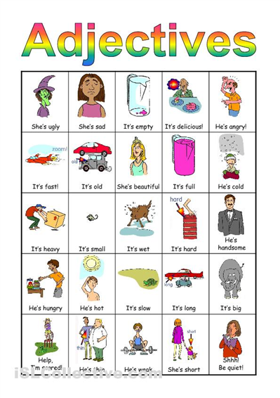
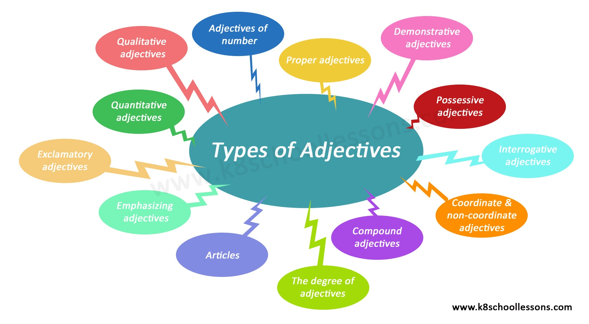

# What are Adjectives?
Adjectives are words that modify or describe nouns or pronouns.

# Adjectives With Examples

- Rebekah painted a beautiful landscape. (Adjective Modifying Noun)
- She is generous. (Adjective Describing Pronoun)

# Types of Adjectives With Examples

 There are generally 8 types of adjectives.
 
  1. proper
  2. descriptive
  3. interrogative
  4. possessive
  5. numeral
  6. demonstrative
  7. distributive
  8. quantitative.

- English grammar is learned at school. (Proper Adjective)
- The weary traveler stayed overnight. (Descriptive Adjective)
- What type of song should I play at the concert? (Interrogative Adjective)
- The boys played football in their backyard. (Possessive Adjective)
- He had three pizzas for lunch. (Numeral Adjective)
- Those players were suspended for violent behavior. (Demonstrative Adjective)
- Every singer was asked to arrive on time for the concert. (Distributive Adjective)
- Dad doesn’t get enough exercise these days. (Quantitative Adjective)
