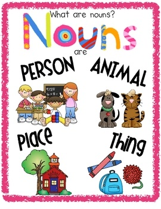
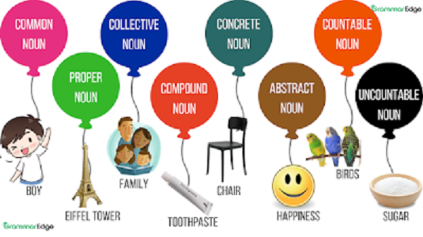

# What are Nouns?
Nouns are words that name persons, places, things, ideas, animals, feelings, events, qualities and actions.

# Nouns With Examples

- Jennifer is my best friend. (Naming a Person)
- I went to Africa over the summer. (Naming a Place)
- The bicycle was stolen. (Naming a Thing)
- We fought for freedom. (Naming an Idea)
- My dog had a trip to the vet. (Naming an Animal)
- He is always sad! (Naming a Feeling)
- The wedding was beautiful. (Naming an Event)
- It took great courage to admit he was wrong. (Naming a Quality)
- The landing of the aircraft was dangerous. (Naming an Action)

# Types of Nouns With Examples

 Here are the 8 types of nouns:
 
    1. proper nouns
    2.  common nouns
    3. concrete nouns
    4. abstract nouns5.
    6. collective nouns 
    7. compound nouns
    8. countable nouns and non-countable nouns

- David is a biblical name. (Proper Noun)
- Where is the toy? (Common Noun)
- The car was stolen. (Concrete Noun)
- All we need is love! (Abstract Noun)
- The class of 2021 has graduated. (Collective Noun)
- The rainwater filled the concrete tank near the barn. (Compound Noun)
- I have several songs (Countable Noun)
- The information is in the book on the shelf. (Non-Countable Noun)

